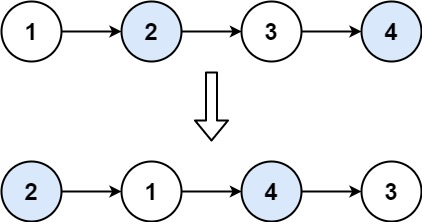

## 1. Requirement

Given a linked list, swap every two adjacent nodes and return its head. You must solve the problem without modifying the
values in the list's nodes (i.e., only nodes themselves may be changed.)

#### Example 1:

- Input: head = [1,2,3,4]
- Output: [2,1,4,3]

#### Explanation:



#### Example 2:

- Input: head = []
- Output: []

#### Example 3:

- Input: head = [1]
- Output: [1]

#### Example 4:

- Input: head = [1,2,3]
- Output: [2,1,3]

#### Constraints:

- The number of nodes in the list is in the range [0, 100].
- 0 <= Node.val <= 100

<hr>

## 2. Solution

Initially:
```text
dummy -> 1 -> 2 -> 3 -> 4
         ^
       first

second = 2
```

We do:
```java
first.next = second.next;
```

So:
```text
1 -> 3 -> 4
```

Then:
```java
second.next = first;
```

So:
```text
2 -> 1 -> 3 -> 4
```

Finally: 
```java
current.next = second;
```

So:
```text
dummy -> 2 -> 1 -> 3 -> 4
```

Then:
```java
current = first;
```

Since `first` is now node `1`, we are positioned here:
```text
dummy -> 2 -> 1 -> 3 -> 4
                ^
              current
```

Now the next iteration swaps `3` and `4`.

Result:
```text
dummy -> 2 -> 1 -> 4 -> 3
```

### Why `dummy` is useful

The first pair is special because the **head itself changes**:
```text
1 -> 2 -> 3 -> 4
```

becomes:
```text
2 -> 1 -> 3 -> 4
^
new head
```

Using:

```java
ListNode dummy = new ListNode(0);
dummy.next = head;
```

gives us:

```text
dummy -> 1 -> 2 -> 3 -> 4
```

Now every pair has a node **before it**, so the same swapping logic works for the first pair too.

And at the end:
```java
return dummy.next;
```

returns:
```text
2 -> 1 -> 4 -> 3
```

without returning the dummy node.
